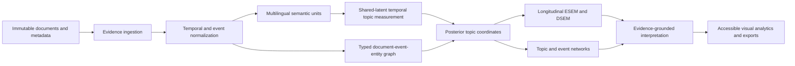

# TEPP Architecture

## Product definition

TEPP is a Temporal Event Psychometrics Platform. It measures multilingual semantic evidence, links documents and event mentions through typed temporal relations, estimates shared latent topic and higher-order psychometric structures, and renders the resulting evidence, uncertainty, trajectories, and networks.

## Bounded services and Rust crates

| Boundary | Primary responsibility |
|---|---|
| `evidence_ingestion` | immutable source bytes, hashes, layout, exact spans, metadata, provenance |
| `temporal_core` | instants, intervals, uncertain dates, partial orders, bitemporal availability and leakage gates |
| `event_ontology` | event mentions, event instances, roles, subevents, products, factors, places, and evidence links |
| `relation_graph` | typed document, segment, event, entity, revision, translation, evidence, and transition edges |
| `membership_model` | time-varying cross-classified and multiple-membership assignments |
| `semantic_preprocessor` | Unicode, segmentation, morphology, dependency phrases, LLM span contracts, validation |
| `concept_dictionary` | versioned multilingual concept alignment and unknown-concept review |
| `topic_measurement` | shared-latent temporal/relational topic estimation and uncertainty |
| `compute_backend` | CPU `f64`, fixed-pool multithreading, CUDA/WGPU, sparse streaming, VRAM budgeting |
| `model_selection` | candidate K, predictive fit, coherence, exclusivity, stability, alignment, fairness, blinded LLM review |
| `psychometric_core` | posterior-plausible-value ESEM, longitudinal invariance, DSEM, continuous-time paths |
| `event_intelligence` | TDT segmentation/link/detection/first-story/tracking and CHRONOS schema reasoning |
| `network_analysis` | log-ratio topic correlation, conditional networks, uncertainty, Leiden consensus clusters |
| `interpretation_gateway` | evidence-bounded LLM interpretation, independent verification, routing and ablations |
| `artifact_service` | model registry, manifests, JSON-LD, GraphML, Arrow/Parquet, tables, SVG/PDF exports |
| `visual_analytics` | bitemporal lens, event graph, topic river, drift, ESEM/DSEM builder, invariance and leakage audit |

Every boundary must be independently usable and expose versioned contracts for integration with organization repositories, `naruon`, and `contextual-orchestrator`.

## Temporal invariants

TEPP stores event/valid time, assertion time, document time, system time, available time, and knowledge cutoff independently. A historical analysis may include a document only when:

\[
\operatorname{available\_time}(d) \leq \operatorname{knowledge\_cutoff}.
\]

Forward transition edges require a temporally valid partial order. Retrospective, revision, translation, citation, support, and contradiction relations retain their direction and provenance but do not create reverse state transitions.

## Measurement invariants

All languages share global topic identities and latent document coordinates. Language-specific lexical emissions, morphology, script, and content deviations are modeled rather than forced to be identical. Validated, calibrated, provisional, and unresolved language profiles are reported separately.

Repeated report vocabulary is modeled through corpus-background, template, section, style, copied-text, prompt, modality, and substantive-topic sources. It is not silently removed by stopword lists, TF-IDF, or BM25.

Topic proportions are compositional. ESEM and network analysis consume logistic-normal latent coordinates or orthonormal log-ratio coordinates, with posterior uncertainty propagated through plausible values or a joint model.

## Compute architecture

The CPU `f64` implementation is the numerical reference. Rayon-style fixed worker pools and thread-local sufficient statistics minimize context switching and oversubscription. GPU work is streamed; temporary responsibilities are never retained for the full corpus. The VRAM controller estimates peak allocation, reserves a safety margin, autotunes micro-batches, records telemetry, reduces batches after OOM, and falls back to CPU safely.

## Persistence

PostgreSQL is the reference relational store. Database objects use two-or-more-word `snake_case` names, including `document_record`, `temporal_interval`, `event_instance`, `event_mention`, `document_relation`, `segment_relation`, `entity_role_assignment`, `model_run`, `topic_definition`, `topic_correlation`, `topic_cluster`, `factor_solution`, `validation_metric`, and `audit_event`.

## Security and trust boundaries

Documents and LLM outputs are untrusted. Exact spans, JSON Schema, size/depth limits, Unicode validity, prompt-injection isolation, provider allowlists, no-tool execution, tenant isolation, immutable audit events, dependency pinning, SBOM, provenance, and reproducible releases are mandatory. LLM live tests use `NVIDIA_NIM_API_KEY`; `COPILOT_GITHUB_TOKEN` is forbidden.
