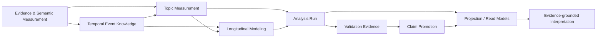

# TEPP Architecture

## Product definition

TEPP is the Temporal Event Psychometrics Platform. It measures multilingual documentary evidence as fallible observations of semantic, event, and psychological structure while preserving temporal eligibility, relation provenance, multilevel/multiple-membership structure, uncertainty, and scientific claim boundaries.

The approved product target is defined in [`docs/product/prd-v0.4-approved.md`](docs/product/prd-v0.4-approved.md). Strategic DDD ownership is defined in [`docs/architecture/domain-context-map.md`](docs/architecture/domain-context-map.md). Cross-repository psychometric/dependence ownership is governed by ADR 0011 and [`docs/architecture/temporal-dependence-composition.md`](docs/architecture/temporal-dependence-composition.md).



## Strategic bounded contexts

Cargo crates are implementation units. A crate, API route, clock type, refusal rule, equation, or ADR number is not automatically a bounded context.

| Bounded context | Domain responsibility | Aggregate / authority | Current implementation nucleus |
| --- | --- | --- | --- |
| Evidence & Semantic Measurement | immutable source evidence, exact spans, multilingual semantic units, concept alignment, method/source-effect admission | `EvidenceCorpus`, `SemanticUnitSet`, `ConceptDictionaryRevision` | `evidence_core`, `semantic_core`; rule-fragment crates are fold candidates |
| Temporal Event Knowledge | six-clock semantics, temporal intervals/partial order, event ontology, typed transition/provenance relations, time-varying memberships | `EventEpisode`, `TemporalRelationSet`, `MembershipAssignmentSet` | `temporal_core`, `event_core`, `relation_graph`, `membership_core`; clock/edge crates are fold candidates |
| Topic Measurement | shared-latent temporal/relational topic estimation, topic identity, uncertainty, model-selection evidence | `TopicModelRun`, `TopicLineage` | `topic_measurement`, `topic_lineage`, `model_selection`, `network_analysis` |
| Longitudinal Modeling | TEPP-owned temporal composition of psychometric models: irregular time, longitudinal invariance/drift, time-varying covariates/random effects/membership, temporal state evolution and alignment | `TemporalModelSpecification`, `TemporalModelRun` | `longitudinal_core`; legacy temporal fragments in `psychometric_core` are staged migration/fold candidates |
| Analysis Run | cutoff-safe lifecycle, idempotency, application orchestration, durable terminal binding; no scientific formula ownership | `AnalysisRun` | `analysis_engine` application modules |
| Scientific Validation | method-specific recovery, RMSE/bias/coverage, convergence, invariance, graph/parity evidence | `ValidationStudy` | `validation_core`, `tepp_simulation` |
| Scientific Claim Promotion | preregistered decision over complete validation evidence; separate from evidence generation and transport success | `ClaimPromotionDecision` | ADR 0014 policy; implementation remains incomplete |
| Projection | typed buyer/consumer read models and exports without changing scientific authority | projection-specific read models | `tepp_api`, artifact/export adapters |

Supporting contexts are Interpretation, Persistence & Recovery, and Runtime Security & Operations. Compute execution, serialization, hashing, transport framing, and accelerator adapters are generic infrastructure and do not define scientific truth.

## Canonical cross-repository ownership

ADR 0011 defines the service boundary.

- `ContextualWisdomLab/fast-mlsirm` owns reusable static/generalized-mixed/dependence-aware psychometric model specification and reusable numerical kernels, including reusable LSIRM, MLSIRM, and DLSJM computation.
- TEPP owns temporal/event composition around a released/versioned upstream candidate: event-or-valid time, assertion time, document time, system time, available time, knowledge cutoff, leakage prevention, irregular intervals, time-varying membership/covariates, longitudinal invariance/drift, state evolution, temporal map alignment, event ontology/graph, and temporal recovery.
- `ContextualWisdomLab/contextual-orchestrator` owns all LLM provider execution, routing/fallback, verifier/adjudicator execution, credentials, and model-call provenance. TEPP never calls a model provider directly.
- Naruon, LineageWeave, Context Graph, and EA Core are external bounded contexts. Integration uses released/versioned contracts and explicit anti-corruption layers; no cross-service SQL is permitted.

When reusable static computation exists in TEPP but belongs to fast-mlsirm, migration is `owner contract -> parity/recovery -> TEPP ACL -> duplicate removal`. A second TEPP production source is not retained for convenience. An open upstream PR head is not a released production dependency.

## Six-clock temporal contract

TEPP has exactly six temporal roles:

1. **event or valid time** — when an event occurs or a state holds; an instant and a validity interval are representations of this same role;
2. **assertion time** — when a claim is stated;
3. **document time** — document creation/publication/revision/reporting period;
4. **system time** — when TEPP records or observes the fact;
5. **available time** — when the evidence could actually be used;
6. **knowledge cutoff** — maximum available time admitted to an analysis.

A historical run enforces:

\[
\operatorname{available\_time}(d) \leq \operatorname{knowledge\_cutoff}.
\]

Event instants and valid-time intervals do not create separate seventh/eighth clocks. Unknown/open availability that could exceed cutoff fails closed.

Forward transition and input-process-outcome relations obey temporal order. Citation, revision, translation, summary, support, contradiction, and retrospective reporting may point backward but never become reverse state transitions.

## Generalized mixed and membership contract

A person, document, segment, item, or occasion may be cross-classified and may have multiple simultaneous memberships. These are different operators:

- **cross-classification** describes non-nested classification dimensions;
- **multiple membership** permits one observation to belong to several units in a dimension with explicit weights.

Membership weights are time-valid and auditable. They are observed/normalized or model-estimated according to the declared formulation; equal weights are never invented as a fallback. Known hierarchy, testlets, item families, raters, methods, and justified covariates are represented before residual latent-space dependence is introduced.

## Dependence-aware temporal composition

TEPP consumes the complete released upstream candidate identity rather than switching on names such as `rasch`, `mirt`, `ggum`, `lsirm`, or `dlsjm`.

- Rasch remains distinct from generic 1PL.
- 2PLM through formulation-qualified 5PLM preserve parameter meaning.
- confirmatory/exploratory MIRT preserve factor/loading semantics;
- dominance and ideal-point/GGUM response processes remain distinct from dependence and temporal operators;
- LSIRM/MLSIRM residual person-item geometry remains distinct from known design structure;
- DLSJM preserves separate local-item and local-person dependence spaces.

Every temporal candidate is `supported`, `research_candidate`, or `unsupported`. Auto-expansion never means auto-activation. `supported` requires the exact combined formulation, temporal state equation, identification/alignment, canonical estimator, primary citations, required data support, and passing known-truth recovery. Primary dependence-family evidence and extension limits are maintained in [`docs/research/temporal-dependence-models.md`](docs/research/temporal-dependence-models.md).

## Longitudinal numerical boundary

Generic temporal standardization belongs in `longitudinal_core`, not in an indefinitely expanding technical `psychometric_core` module. Model-specific static covariance/likelihood primitives migrate to fast-mlsirm when they are reusable static psychometric computation.

A lagged correlation is defined only from a valid lagged covariance and **both** marginal variances:

\[
\rho_{t,t+\Delta} =
\frac{\operatorname{Cov}(Y_t,Y_{t+\Delta})}
{\sqrt{\operatorname{Var}(Y_t)\operatorname{Var}(Y_{t+\Delta})}}.
\]

A covariance divided only by the initial variance is not generally an autocorrelation under nonstationary marginals. The repaired Longitudinal Modeling contract therefore requires both marginals and checks the covariance bound. Detailed Driver/Oud/Voelkle equation evidence stays in [`docs/research/multilevel-event-time-recovery.md`](docs/research/multilevel-event-time-recovery.md), not in this architecture table.

## Analysis Run application boundary

`analysis_engine` orchestrates accepted domain capabilities. `tepp_api` is a transport/projection adapter. HTTP routes, CLI verbs, export operations, project-history operations, and individual refusal helpers do not establish new bounded contexts or scientific authority.

Target application layout is capability-oriented rather than a flat one-file-per-rule list:

```text
analysis_engine/src/
  runs/
  evidence_measurement/
  topic_measurement/
  longitudinal_modeling/
  event_intelligence/
  validation/
```

Transport-only behavior stays in `tepp_api`. Persistence adapters implement domain/application repositories; domain code does not import PostgreSQL, HTTP, CLI, or provider-specific DTOs.

## Current implementation topology and migration

Protected main contains useful domain primitives alongside many historical one-rule/one-clock crates and a large `psychometric_core`. Those implementation paths are not target ownership.

The delivery recovery folds fragments into the owning contexts while preserving unique tests, research, review evidence, and public compatibility where required. Representative folds are:

| Current fragments | Owning context |
| --- | --- |
| `system_clock`, `event_clock`, `assertion_clock`, `cutoff_clock`, `available_clock`, `document_clocks`, `revision_order` | Temporal Event Knowledge |
| `summarizes_edge`, `retrospective_edge`, `support_edge`, `citation_edge`, `outcome_order`, `subevent_containment`, `prediction_contradiction`, `relation_absence`, `role_contradiction` | Temporal Event Knowledge |
| `location_membership`, `episode_membership`, `membership_target` | Temporal Event Knowledge |
| `prompt_source`, `style_source`, `modality_source`, `copied_text`, `copy_identity`, `corpus_background`, `stopword_deletion`, `payload_bound`, `derived_sensitivity` | Evidence & Semantic Measurement |
| event-time correlation standardization | Longitudinal Modeling / `longitudinal_core` |
| reusable static/generalized-mixed/dependence psychometric kernels in TEPP | fast-mlsirm owner path after parity/recovery |
| flat Analysis Run route/refusal modules | capability-oriented Analysis Run modules |

A repository-wide rename across a large active PR fleet is not used as a shortcut. Path repair is staged through coherent landing vehicles, but legacy paths are not canonical merely because migration is staged.

## Scientific validation and claim promotion

Validation Evidence and Scientific Claim Promotion are separate authorities.

A validation artifact may contain known-truth parameter recovery, RMSE, bias, interval coverage, convergence, invariance, graph recovery, temporal ordering, CPU/GPU parity, and Monte Carlo uncertainty. It does not itself grant a global `scientific_acceptance=true` flag.

Claim promotion applies a preregistered method-specific evidence contract. Scale-invariant self-referential gates such as comparing an error magnitude with an uncertainty estimate computed from the same residual vector cannot substitute for a scientifically meaningful acceptance bound. LLM judgments and transport success cannot satisfy numerical evidence requirements.

## Compute architecture

All TEPP-owned production mathematical/statistical arithmetic is Rust-first. Deterministic CPU `f64` is the scientific numerical reference. Parallel CPU execution uses bounded/fixed worker pools and deterministic reduction where required. GPU/MLX/OpenCL/CUDA paths must demonstrate parity against the CPU reference and bounded memory/OOM fallback behavior before they are scientific evidence.

A compute receipt proves that a named backend executed a named operation; it does not prove estimator validity.

## Persistence

PostgreSQL is the reference relational store. Domain persistence is normalized, tenant/time/provenance aware, and uses descriptive multiword `snake_case` objects. Bitemporal/interval constraints, immutable evidence/provenance, explicit idempotency/UPSERT behavior, and measured hot-partition behavior are required where applicable.

`persistence_postgres` is an adapter. Other contexts do not query its tables directly, and external CWL services never read/write TEPP application tables.

## Security and trust boundaries

Documents, external metadata, serialized payloads, model artifacts, and LLM output are untrusted until their owning boundary validates identity, provenance, size/depth, authorization, and scientific semantics. Source text and secrets are not copied into ordinary operational telemetry. Service/provider credentials are scoped to their owner and cannot be repurposed as review/release authority.

## Documentation and research authority

- product target: [`docs/product/prd-v0.4-approved.md`](docs/product/prd-v0.4-approved.md)
- DDD context map: [`docs/architecture/domain-context-map.md`](docs/architecture/domain-context-map.md)
- service/dependence boundary: ADR 0011 and [`docs/architecture/temporal-dependence-composition.md`](docs/architecture/temporal-dependence-composition.md)
- general standards/literature: [`docs/research/standards-and-literature.md`](docs/research/standards-and-literature.md)
- LSIRM/MLSIRM/DLSJM evidence: [`docs/research/temporal-dependence-models.md`](docs/research/temporal-dependence-models.md)
- longitudinal/ctsem equation evidence: [`docs/research/multilevel-event-time-recovery.md`](docs/research/multilevel-event-time-recovery.md)
- scientific promotion: ADR 0014 and [`docs/TRACEABILITY.md`](docs/TRACEABILITY.md)

Detailed equation-by-equation recovery evidence belongs in research/doctoring documents and executable tests, not duplicated into architecture responsibility tables.