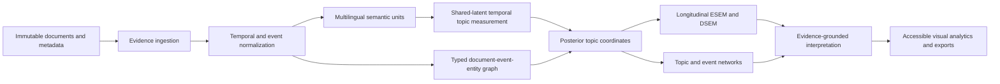

# TEPP Architecture

## Product definition

TEPP is a Temporal Event Psychometrics Platform. It measures multilingual semantic evidence, links documents and event mentions through typed temporal relations, estimates shared latent topic and higher-order psychometric structures, and renders the resulting evidence, uncertainty, trajectories, and networks.

## Bounded services and Rust crates

| Boundary | Primary responsibility |
|---|---|
| `evidence_ingestion` | immutable source bytes, hashes, layout, exact spans, metadata, provenance |
| `temporal_core` | instants, intervals, uncertain dates, partial orders, bitemporal availability and leakage gates |
| `event_ontology` | event mentions, event instances, roles, subevents, products, factors, places, and evidence links |
| `relation_graph` | typed document, segment, event, entity, revision, translation, evidence, and transition edges |
| `membership_model` | time-varying cross-classified and multiple-membership assignments |
| `semantic_preprocessor` | Unicode, segmentation, morphology, dependency phrases, LLM span contracts, validation |
| `concept_dictionary` | versioned multilingual concept alignment and unknown-concept review |
| `topic_measurement` | shared-latent temporal/relational topic estimation and uncertainty |
| `compute_backend` | CPU `f64`, fixed-pool multithreading, CUDA/WGPU, sparse streaming, VRAM budgeting |
| `model_selection` | candidate K, predictive fit, coherence, exclusivity, stability, alignment, fairness, blinded LLM review |
| `psychometric_core` | posterior-plausible-value ESEM, longitudinal invariance, DSEM, continuous-time paths |
| `event_intelligence` | TDT segmentation/link/detection/first-story/tracking and CHRONOS schema reasoning |
| `network_analysis` | log-ratio topic correlation, conditional networks, uncertainty, Leiden consensus clusters |
| `interpretation_gateway` | evidence-bounded LLM interpretation, independent verification, routing and ablations |
| `artifact_service` | model registry, manifests, JSON-LD, GraphML, Arrow/Parquet, tables, SVG/PDF exports |
| `visual_analytics` | bitemporal lens, event graph, topic river, drift, ESEM/DSEM builder, invariance and leakage audit |

Every boundary must be independently usable and expose versioned contracts for integration with organization repositories, `naruon`, and `contextual-orchestrator`.

## Implemented foundation topology

Task 1 materializes the first storage-independent workspace boundaries. The
crate names are stable implementation identifiers, while the broader service
boundaries above remain the target modular MSA architecture.

| Rust crate | Initial responsibility |
|---|---|
| `evidence_core` | immutable evidence domain primitives |
| `temporal_core` | typed clocks, intervals, and temporal reasoning |
| `event_core` | event instances, mentions, roles, and provenance |
| `relation_graph` | typed relations and forward-transition validation |
| `membership_core` | time-varying cross-classified multiple membership, Kish ESS, nested ICC with non-nested refusal |
| `persistence_postgres` | PostgreSQL repositories and migrations |
| `corpus_split` | cutoff-safe, relation-aware partitioning |
| `tepp_simulation` | known-truth temporal/event data generation |
| `validation_core` | RMSE, bias, coverage, graph, and Monte Carlo metrics |
| `tepp_api` | versioned DTO, schema, and export contracts |
| `provider_receipt` | provider-disclosure field-code receipts; source text and identity are not disclosable |
| `operational_log` | operational logs; `try_record` is the only recording API; source text and source identity are not loggable; `persistence_postgres` `audit_event` inserts call the same gate |
| `service_tls` | production TLS bind gates and rustls server config |
| `derived_sensitivity` | derived topic/factor/relation outputs inherit source sensitivity |
| `longitudinal_core` | active-PR: within/between decomposition; refuse between-as-within; component RMSE |
| `topic_lineage` | global topic identity across active/dormant/reactivated states |
| `network_analysis` | compositional cluster-pair gates; raw simplex is not Euclidean |
| `interpretation_gateway` | evidence-bounded LLM interpretations; not estimators or observed facts |
| `model_selection` | statistical/Pareto candidate-`K` gates; LLM votes are not numerical authority |
| `checkpoint_authority` | a model checkpoint is not the CPU `f64` estimator |

No crate exposes placeholder production behavior in Task 1. This prevents an
empty façade from becoming a de facto public API before its invariants and tests
exist.

## Immutable evidence boundary

Task 2 begins the executable `evidence_core` boundary. Stable RFC 9562 `UUIDv7`
identities are independent from canonical `SHA-256` content digests. Source
bytes and UTF-8 document text are copied into immutable owned storage, bounded
before allocation, and verified without exposing mutable fields.

A source span records an owning document, a half-open UTF-8 byte range, the
matching half-open Unicode-scalar range, and optional page/layout geometry. It
fails closed for empty or reversed ranges, byte or scalar overflow,
mid-code-point boundaries, coordinate disagreement, cross-document use,
nonfinite geometry, nonpositive dimensions, and rectangles outside the page.
Scalar coordinates are evidence locations rather than grapheme, word, or
sentence boundaries; language-tailored segmentation remains a later module.

The boundary now exposes a strict JSON wire version `1` without exposing private
Rust fields. Artifacts, documents, spans, and nested page locations are serialized
through explicit DTOs with unknown-field rejection. Reconstruction parses and
revalidates RFC 9562 identifiers, canonical digests, content limits, exact text
coordinates, document ownership, and page geometry. Artifact bytes and document
text are rehashed during reconstruction, and digest substitution fails closed.
Malformed JSON, unsupported versions, invalid byte values, and unknown nested
fields produce stable content-redacting errors.

Persistence, JSON Schema publication, JSON-LD, GraphML, source acquisition
metadata, signatures, and W3C PROV remain outward adapters or later contracts.
They must depend inward on these validated domain values rather than defining
them.

## Quality architecture

The workspace centralizes package metadata and Rust/Clippy lints. Every member
inherits `unsafe_code = "forbid"`, `missing_docs = "deny"`, and warning denial.
Repository contract scripts independently verify the approved crate set,
workspace inheritance, action SHA pinning, absence of LLM credentials from
ordinary CI, and complete Rust documentation.

Stable Rust 1.97.1 is the compile, lint, test, and line-coverage reference.
Branch coverage runs in a pinned nightly lane because LLVM branch coverage
remains unstable in Rust. `cargo-nextest` runs tests without retries, while
doctests remain a separate `cargo test --doc` gate. `cargo-deny` enforces
advisory, license, ban, and source policy. Failed Rust coverage gates print the
exact missing source locations from the same instrumented run without weakening
the 100% contract.

## Temporal invariants

TEPP stores event/valid time, assertion time, document time, system time, available time, and knowledge cutoff independently. A historical analysis may include a document only when:

\[
\operatorname{available\_time}(d) \leq \operatorname{knowledge\_cutoff}.
\]

Forward transition edges require a temporally valid partial order. Retrospective, revision, translation, citation, support, and contradiction relations retain their direction and provenance but do not create reverse state transitions.

## Measurement invariants

All languages share global topic identities and latent document coordinates. Language-specific lexical emissions, morphology, script, and content deviations are modeled rather than forced to be identical. Validated, calibrated, provisional, and unresolved language profiles are reported separately.

Repeated report vocabulary is modeled through corpus-background, template, section, style, copied-text, prompt, modality, and substantive-topic sources. It is not silently removed by stopword lists, TF-IDF, or BM25.

Topic proportions are compositional (Aitchison, 1982). ESEM and network analysis consume logistic-normal latent coordinates or orthonormal log-ratio coordinates, with posterior uncertainty propagated through plausible values or a joint model (Asparouhov & Muthén, 2009; Asparouhov et al., 2018; Marsh et al., 2014). The product topic-estimator contract is TRSL-TM (ADR 0012); an STM-style logistic-normal family is the reference, not a shipped-backend claim (Blei & Lafferty, 2006; Roberts et al., 2014, 2019). TDT/CHRONOS event intelligence remains an accepted-target boundary (Allan, 2002; Anagnostopoulos et al., 2013).

## Compute architecture

The CPU `f64` implementation is the numerical reference. Rayon-style fixed worker pools and thread-local sufficient statistics minimize context switching and oversubscription. GPU work is streamed; temporary responsibilities are never retained for the full corpus. The VRAM controller estimates peak allocation, reserves a safety margin, autotunes micro-batches, records telemetry, reduces batches after OOM, and falls back to CPU safely.

## Persistence

PostgreSQL is the reference relational store. Database objects use two-or-more-word `snake_case` names, including `document_record`, `temporal_interval`, `event_instance`, `event_mention`, `document_relation`, `segment_relation`, `entity_role_assignment`, `model_run`, `topic_definition`, `topic_correlation`, `topic_cluster`, `factor_solution`, `validation_metric`, and `audit_event`. `audit_event` inserts call `operational_log::try_record` before SQL is rendered so source text and source identity cannot enter the row.

## Security and trust boundaries

Documents and LLM outputs are untrusted. Exact spans, JSON Schema, size/depth limits, Unicode validity, prompt-injection isolation, provider allowlists, no-tool execution, tenant isolation, immutable audit events, dependency pinning, SBOM, provenance, and reproducible releases are mandatory. LLM live tests use `NVIDIA_NIM_API_KEY`; `COPILOT_GITHUB_TOKEN` is forbidden.

## References

The full APA 7th register is [`docs/research/standards-and-literature.md`](docs/research/standards-and-literature.md). Method claims on this page use:

Aitchison, J. (1982). The statistical analysis of compositional data. *Journal of the Royal Statistical Society: Series B, 44*(2), 139–177. https://doi.org/10.1111/j.2517-6161.1982.tb01195.x

Allan, J. (Ed.). (2002). *Topic detection and tracking: Event-based information organization*. Kluwer Academic Publishers.

Anagnostopoulos, E., Batsakis, S., & Petrakis, E. G. M. (2013). CHRONOS: A reasoning engine for qualitative temporal information in OWL. *Procedia Computer Science, 22*, 70–77. https://doi.org/10.1016/j.procs.2013.09.082

Asparouhov, T., Hamaker, E. L., & Muthén, B. (2018). Dynamic structural equation models. *Structural Equation Modeling, 25*(3), 359–388. https://doi.org/10.1080/10705511.2017.1406803

Asparouhov, T., & Muthén, B. (2009). Exploratory structural equation modeling. *Structural Equation Modeling, 16*(3), 397–438. https://doi.org/10.1080/10705510903008204

Blei, D. M., & Lafferty, J. D. (2006). Dynamic topic models. In *Proceedings of the 23rd International Conference on Machine Learning* (pp. 113–120). ACM. https://doi.org/10.1145/1143844.1143859

Marsh, H. W., Morin, A. J. S., Parker, P. D., & Kaur, G. (2014). Exploratory structural equation modeling: An integration of the best features of exploratory and confirmatory factor analysis. *Annual Review of Clinical Psychology, 10*, 85–110. https://doi.org/10.1146/annurev-clinpsy-032813-153700

Roberts, M. E., Stewart, B. M., Tingley, D., Lucas, C., Leder-Luis, J., Gadarian, S. K., Albertson, B., & Rand, D. G. (2014). Structural topic models for open-ended survey responses. *American Journal of Political Science, 58*(4), 1064–1082. https://doi.org/10.1111/ajps.12103

Roberts, M. E., Stewart, B. M., & Tingley, D. (2019). stm: An R package for structural topic models. *Journal of Statistical Software, 91*(2), 1–40. https://doi.org/10.18637/jss.v091.i02
