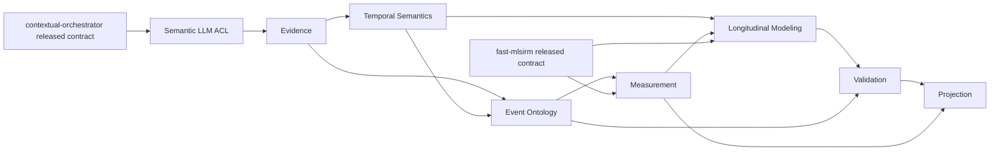

# TEPP Architecture

## Product definition

TEPP is a multilingual temporal relational psychometrics platform. It preserves source evidence and temporal availability, builds typed event/relation structures, estimates latent measurement models, composes longitudinal/event-time models, validates recovery and uncertainty, and projects only evidence appropriate to downstream consumers.

Detailed scientific estimands, equations, citations, implementation evidence, and recovery status belong in `docs/TRACEABILITY.md` and the corresponding doctoring/research documents. This architecture document owns service/context responsibility and dependency direction; it does not duplicate estimator-by-estimator scientific prose.

## DDD context map

| Bounded context | Type | TEPP responsibility | Outbound dependency rule |
|---|---|---|---|
| Evidence | Core | immutable source identity/content digests, exact spans, provenance, evidence availability | no inferred scientific result becomes source evidence |
| Temporal Semantics | Core | event/valid, assertion, document, system, available time and knowledge cutoff; interval topology; leakage gates | OWL-Time/ISO-TimeML mappings are adapters, not internal identity |
| Event Ontology | Core | event instances/mentions, roles, subevents, temporal relations, forward-transition invariants | retrospective/citation/provenance edges never become reverse transitions |
| Measurement | Core | TEPP-specific multilingual shared-latent measurement composition and posterior artifact contracts | reusable static/generalized-mixed/dependence psychometric arithmetic comes from released `fast-mlsirm` contracts |
| Longitudinal Modeling | Core | irregular event-time/state composition, trajectories, temporal alignment, time-varying multilevel/cross-classified/multiple-membership composition | static reusable covariance/dependence kernels remain `fast-mlsirm` owned |
| Validation | Core | true-parameter recovery, RMSE, bias, coverage, convergence, calibration, leakage-safe rolling-origin evidence, parity receipts | no LLM judgment substitutes for numerical/scientific acceptance |
| Projection | Supporting | buyer/API/export projections, immutable manifests, exact-value representations | latent estimates are not promoted to enterprise-architecture facts |
| Semantic LLM ACL | Supporting | task/evidence/access policy, schema validation, semantic result provenance | provider discovery/routing/execution only through a released `contextual-orchestrator` contract |
| Persistence | Generic | repositories, 3NF relational persistence, bitemporal/interval constraints, audit/provenance storage | no cross-service SQL |
| Compute | Generic | Rust CPU `f64` reference, bounded parallelism, backend parity/receipts, OOM recovery | accelerator use cannot change the estimand |

Shared Kernel is intentionally minimal: opaque identities, canonical digests, strict version identifiers, and clock/value types whose semantics are identical across participating TEPP contexts. Context-specific aggregates, repositories, policies, or scientific estimands do not enter the Shared Kernel.

## Aggregate and invariant ownership

Evidence owns immutable source artifacts/documents and exact evidence spans. Temporal Semantics owns clock values, uncertain intervals, and cutoff eligibility. Event Ontology owns event/relation consistency. Measurement owns TEPP measurement-run composition and posterior artifacts. Longitudinal Modeling owns event-time transition/state composition. Validation owns validation/recovery evidence and promotion refusal. Projection owns export/projection manifests.

Cross-context behavior is coordinated by application services and domain events. A context does not reach into another context's tables or internal modules to make a scientific decision. Compatibility is through explicit ports/ACLs and versioned contracts.

## Temporal invariants

TEPP keeps these clocks distinct end to end:

1. `event_time` / valid time;
2. `assertion_time`;
3. `document_time`;
4. `system_time`;
5. `available_time`;
6. `knowledge_cutoff`.

Historical analysis admission requires `available_time <= knowledge_cutoff`. Filtering happens before duplicate-identity, count, membership-total, inference, or terminal-state logic so future-unavailable evidence cannot change a historical result.

Forward state-transition and input/process/outcome relations require a valid forward event-time partial order. Citation, revision, translation, support, contradiction, summary, and retrospective-reporting relations retain their own direction/provenance but do not become reverse transitions.

## Measurement and Longitudinal Modeling ownership

TEPP does not use `psychometric_core` as an architectural dumping ground. New temporal/state composition belongs to Longitudinal Modeling. Reusable static/generalized-mixed/dependence-aware psychometric arithmetic—including reusable LSIRM/MLSIRM/DLSJM kernels—belongs to `fast-mlsirm` and is consumed only from an immutable released/versioned Published Language through a TEPP ACL.

TEPP preserves exact Rasch identity rather than flattening it into a generic 1PL label, and keeps 2PLM–5PLM, confirmatory/exploratory MIRT, ideal-point/GGUM, testlet, rater/facet, generalized-mixed, cross-classified, multiple-membership, LSIRM/MLSIRM/DLSJM candidate identities distinct. Cross-classification and multiple membership are separate semantics; membership weights are explicit, auditable, time-valid, and normalized or model-estimated according to the declared formulation.

Known hierarchy/testlet/rater/method/item-family structure precedes residual latent-space dependence. Local item dependence, local person dependence, and residual person-item interaction are diagnosed separately. Temporal DLSJM composition keeps item- and person-dependence spaces distinct and requires temporal alignment for translation/rotation/reflection and cluster-label comparison.

Scientific details and current implementation maturity are generated/traced in `docs/TRACEABILITY.md` rather than copied into responsibility-table cells.

## Implemented Rust/application boundaries

The repository contains fine-grained crates created during foundation work. Their existence does not mint new bounded contexts. Small rule/clock crates are implementation modules until consolidation; architecture authority remains the context map above.

Representative inward domain modules include `evidence_core`, `temporal_core`, `event_core`, `relation_graph`, `membership_core`, `validation_core`, `longitudinal_core`, and `topic_measurement`. `analysis_engine` is an application service that composes admitted evidence into digest-bound analysis results. `tepp_api` owns versioned wire/DTO contracts. `persistence_postgres` is an infrastructure adapter.

One-operation/profile modules such as location/episode/membership/edge refusal helpers remain implementation details of their owning context and should fold into coherent context/application vehicles rather than become permanent architectural service identities.

## Semantic LLM boundary

All semantic LLM work—semantic unitization, interpretation, verification, judging, label/explanation proposal, and model-backed automation—crosses the Semantic LLM ACL and consumes a **released, versioned `contextual-orchestrator` API/client/schema**.

TEPP owns:

- semantic task and minimum evidence bundle;
- source-span/provenance requirements;
- tool/access policy;
- role/reasoning/verification policy;
- scientific-risk and abstention policy;
- schema validation and result admission.

`contextual-orchestrator` owns:

- provider credential/key auto-discovery;
- provider/model/group routing;
- `orchestrator/free` and paid/free admission policy;
- request-family adaptation for embeddings/responses/completions/audio/video/image/omni-modal capabilities;
- provider fallback and lifecycle handling;
- streaming/tool-call execution and provider termination semantics.

TEPP does not import provider SDKs or provider keys as a fallback, does not hard-code a provider/model/group, and does not choose a paid route. Model-backed GitHub Actions request `orchestrator/free` through the gateway credential only. If the released owner contract does not provide the required capability, the consumer fails closed and the owner must release the capability before adoption.

A protected-main commit, open PR head, or checksum-pinned source snapshot without an immutable release is candidate evidence, not production dependency authority. At the 2026-09-02 architecture review, contextual-orchestrator has no GitHub release, so production semantic execution through that boundary remains non-deployable.

LLM outputs are untrusted proposals. They never perform numerical estimation, scientific acceptance, or authoritative activation.

## External owner boundaries

### fast-mlsirm

`fast-mlsirm` owns reusable static/generalized-mixed/dependence-aware psychometric arithmetic and reusable LSIRM/MLSIRM/DLSJM kernels. TEPP consumes only released/versioned artifacts with deterministic manifest schema/version/digest and typed membership semantics. Mutable sibling PR heads are research/integration candidates only.

### contextual-orchestrator

`contextual-orchestrator` owns provider routing/execution and orchestration transport. TEPP consumes a released contract through the Semantic LLM ACL; direct provider calls and source-copy integration are forbidden.

### context-graph-contracts / enterprise-architecture-core

Context Graph contracts and EA projections are external owner paths. TEPP may prepare conformance fixtures against candidate schemas, but deployable integration requires released/versioned contracts with provenance. TEPP latent estimates, measurement scores, inferred event relations, or validity evidence do not become authoritative enterprise-architecture facts. EA receives product/service/lifecycle/dependency/risk/ownership/remediation/transformation projections only through released contracts.

## Persistence and data architecture

PostgreSQL is the reference relational store. Persistent design is 3NF by default, uses descriptive multiword `snake_case`, and preserves tenant, provenance, valid/event time, system time, availability, version, lifecycle, and audit dimensions where applicable.

Bitemporal and interval validity constraints belong in the database as well as domain types. Multiple-membership assignments are explicit rows with auditable weights and validity intervals. UPSERT/idempotency semantics must be declared per repository operation; hot partitions and lock scope are tested rather than assumed. No service reads another service's application tables directly.

## Compute architecture

Production scientific arithmetic is Rust-first. Deterministic CPU `f64` is the reference. Parallel CPU work uses bounded worker pools and deterministic/stable reductions where the estimand requires them. GPU/accelerator paths are introduced only when materially justified and must prove parity against CPU reference evidence. OOM is a typed recoverable condition with bounded batch reduction/fallback rather than an unhandled state.

Python/R may serve interoperability, validation, or independent-oracle boundaries only where no practical Rust substitute exists; such use requires an ADR rationale and removal condition. Synthetic data is unit/recovery infrastructure, not product scientific acceptance by itself.

## Validation architecture

Each temporal/scientific candidate declares the parameters/states it must recover. Acceptance uses realistic true-parameter state/trajectory recovery, RMSE, bias, interval coverage, convergence, reproducibility, and Monte Carlo uncertainty. Leakage-safe rolling-origin evaluation preserves event time versus availability time, irregular gaps, delayed/retrospective reports, missing occasions, changing memberships, and language/source drift.

Skipped/ignored/xfail tests, source rewriting, sample shrinkage that changes the scientific target, or coverage-denominator tricks are not evidence.

## Quality architecture

Repository quality gates enforce Rust format/build/Clippy/tests/rustdoc, production statement/branch coverage, public documentation, dependency/security policy, architecture/documentation fitness, and exact-head evidence. A queued/pending workflow is non-passing.

An open PR or ADR may be `active-PR` or `research-only`; it is not `implemented-main` merely because source exists. Implementation maturity and architecture decision status are separate authorities. Repository-wide ADR IDs are unique/immutable and deterministic fitness tests reject duplicate IDs/targets/index rows.

## Security and trust boundaries

Source documents, serialized payloads, checkpoints, connector responses, and LLM outputs are untrusted until their owning boundary validates identity, provenance, bounds, authorization, and semantics. Purpose-bound PII handling uses opaque analytical identities, protected identity mappings, encryption, selective disclosure, retention/deletion, and auditable privileged access without destroying valid authorship/temporal/membership evidence.

Scientific integrity is a security property: temporal leakage, unsupported cross-language equivalence, failed uncertainty coverage, backend divergence, untracked mutable dependencies, or causal overclaiming fails closed.

## Release architecture

A TEPP release requires a coherent protected-head buyer/scientific vertical, version and CHANGELOG consistency, exact-head CI/security/recovery evidence, immutable package artifacts, SBOM/provenance/reproducibility, rollback/recovery evidence, and every production integration bound to released/versioned external contracts. No release is published merely to turn an active PR into authority.

## Canonical detail references

- Product requirements: `docs/product/prd-v0.4-approved.md` and active versioned amendments
- Technical requirements: `docs/TRD.md`
- Requirement/scientific/implementation traceability: `docs/TRACEABILITY.md`
- DDD/ADR authority: `docs/adr/README.md`, `docs/adr/ADR_POLICY.md`
- UML/runtime flows: `docs/UML.md`
- ERD: `docs/ERD.md`
- API contracts: `docs/API_CONTRACT.md`
- LLM boundary: `docs/LLM_ORCHESTRATION.md`
- Test/recovery strategy: `docs/TEST_STRATEGY.md`
- Operability/release: `docs/OPERABILITY.md`
- Security/threat model: `SECURITY.md`, `docs/THREAT_MODEL.md`
- Primary research/standards: `docs/research/standards-and-literature.md` and estimator-specific doctoring files

The Git history retains superseded architecture prose. Current architecture authority is this bounded-context/ownership map plus the code-current traceability documents above; estimator equations and evidence are intentionally not duplicated into architectural responsibility rows.
