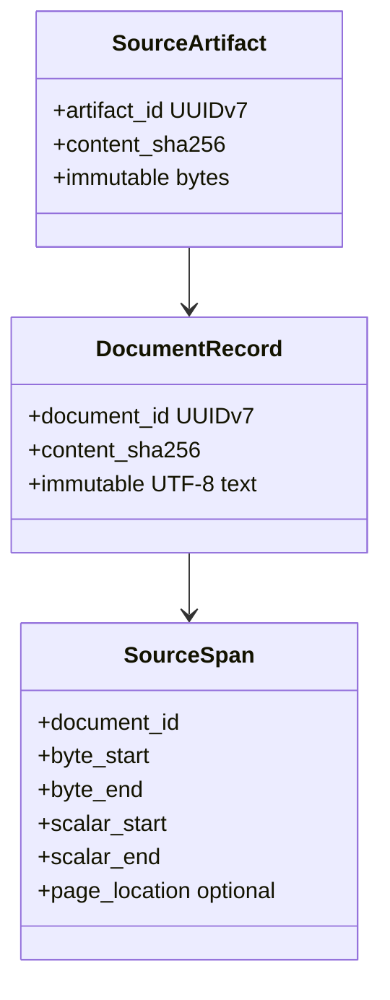

# TEPP Logical and Persistence ERD

**Status:** Accepted logical target model with current implementation maturity explicitly marked.  
**Last reviewed:** 2026-08-13

Protected main implements storage-independent domain objects plus `persistence_postgres` foundation tables (`0001`), tenant row-level security (`0002`), the model-run/artifact chain (`0003`), append-only immutability triggers (`0004`), temporal interval ordering CHECKs (`0005`), typed membership assignment (`0006`), event-relation/mention/instance SQL, source-artifact SQL, audit-event SQL, and naruon HTTP interchange contracts as executable migration/application contracts with live CI. Concurrent document-write stress (atomic revise + live multi-session proof) is on the active PR and is not implemented-main until exact-head checks, review, and protected-main integration complete. Broader planned ERD entities and backup/recovery gates remain accepted-target.

## Current domain foundation

These names summarize the current `evidence_core` domain; they are not PostgreSQL table claims.

## Planned PostgreSQL ERD

```mermaid
erDiagram
    TENANT_RECORD ||--o{ DOCUMENT_RECORD : owns
    SOURCE_ARTIFACT ||--o{ DOCUMENT_RECORD : contains
    DOCUMENT_RECORD ||--o{ TEXT_SEGMENT : contains
    DOCUMENT_RECORD ||--o{ TEMPORAL_ASSERTION : carries
    TEXT_SEGMENT ||--o{ EVENT_MENTION : evidences
    EVENT_INSTANCE ||--o{ EVENT_MENTION : realized_by
    EVENT_INSTANCE ||--o{ EVENT_RELATION : source_event
    EVENT_INSTANCE ||--o{ EVENT_RELATION : target_event
    TEXT_SEGMENT ||--o{ EVENT_RELATION : relation_evidence
    ENTITY_RECORD ||--o{ ENTITY_ROLE_ASSIGNMENT : assigned
    EVENT_INSTANCE ||--o{ ENTITY_ROLE_ASSIGNMENT : contextualizes
    PROJECT_RECORD ||--o{ ENTITY_ROLE_ASSIGNMENT : contextualizes
    DOCUMENT_RECORD ||--o{ MEMBERSHIP_ASSIGNMENT : document_observation
    TEXT_SEGMENT ||--o{ MEMBERSHIP_ASSIGNMENT : segment_observation
    ENTITY_RECORD ||--o{ MEMBERSHIP_ASSIGNMENT : entity_membership_target
    PROJECT_RECORD ||--o{ MEMBERSHIP_ASSIGNMENT : project_membership_target
    CORPUS_SPLIT_MANIFEST ||--o{ MODEL_RUN : supplies_split
    REPRODUCIBILITY_MANIFEST ||--o{ MODEL_RUN : binds_run
    REPRODUCIBILITY_MANIFEST ||--o{ MODEL_ARTIFACT : governs
    MODEL_RUN ||--o{ MODEL_ARTIFACT : publishes
    MODEL_RUN ||--o{ TOPIC_DEFINITION : estimates
    MODEL_RUN ||--o{ TOPIC_SCORE : estimates
    MODEL_RUN ||--o{ VALIDATION_METRIC : reports
    TOPIC_DEFINITION ||--o{ TOPIC_CORRELATION : source_topic
    TOPIC_DEFINITION ||--o{ TOPIC_CORRELATION : target_topic
    TOPIC_CLUSTER ||--o{ CLUSTER_MEMBERSHIP : contains
    TOPIC_DEFINITION ||--o{ CLUSTER_MEMBERSHIP : member
    MODEL_RUN ||--o{ FACTOR_SOLUTION : estimates
    FACTOR_SOLUTION ||--o{ FACTOR_LOADING : contains
    MODEL_RUN ||--o{ AUDIT_EVENT : evidenced_by

    TENANT_RECORD {
      uuid tenant_record_id PK
      text tenant_status_code
      timestamptz created_at
    }

    SOURCE_ARTIFACT {
      uuid source_artifact_id PK
      uuid tenant_record_id FK
      text content_sha256 UK
      bigint source_size_bytes
      text media_type_code
      text protected_object_ref
      timestamptz system_time
      timestamptz available_time
    }

    DOCUMENT_RECORD {
      uuid document_record_id PK
      uuid tenant_record_id FK
      uuid source_artifact_id FK
      text content_sha256
      text language_profile_code
      timestamptz assertion_time
      timestamptz document_time
      timestamptz system_time
      timestamptz available_time
    }

    TEXT_SEGMENT {
      uuid text_segment_id PK
      uuid document_record_id FK
      bigint byte_start
      bigint byte_end
      bigint scalar_start
      bigint scalar_end
      text segment_type_code
    }

    TEMPORAL_ASSERTION {
      uuid temporal_assertion_id PK
      uuid document_record_id FK
      text clock_type_code
      timestamptz lower_time
      timestamptz upper_time
      text lower_boundary_code
      text upper_boundary_code
      text source_precision_code
    }

    EVENT_INSTANCE {
      uuid event_instance_id PK
      uuid tenant_record_id FK
      text event_type_code
      timestamptz valid_from
      timestamptz valid_to
      text lifecycle_status_code
    }

    EVENT_MENTION {
      uuid event_mention_id PK
      uuid event_instance_id FK
      uuid text_segment_id FK
      numeric confidence_score
    }

    EVENT_RELATION {
      uuid event_relation_id PK
      uuid source_event_id FK
      uuid target_event_id FK
      text relation_type_code
      uuid evidence_segment_id FK
      numeric confidence_score
      boolean transition_edge
    }

    ENTITY_RECORD {
      uuid entity_record_id PK
      uuid tenant_record_id FK
      text entity_type_code
      text canonical_name
    }

    PROJECT_RECORD {
      uuid project_record_id PK
      uuid tenant_record_id FK
      text project_type_code
      text lifecycle_status_code
    }

    ENTITY_ROLE_ASSIGNMENT {
      uuid entity_role_assignment_id PK
      uuid entity_record_id FK
      uuid event_instance_id FK
      uuid project_record_id FK
      text role_type_code
      timestamptz valid_from
      timestamptz valid_to
      numeric membership_weight
      uuid evidence_segment_id FK
    }

    MEMBERSHIP_ASSIGNMENT {
      uuid membership_assignment_id PK
      uuid document_record_id FK
      uuid text_segment_id FK
      uuid target_entity_id FK
      uuid target_project_id FK
      text membership_type_code
      numeric membership_weight
      tstzrange valid_from_window
      tstzrange valid_to_window
      text valid_time_precision_code
    }

    CORPUS_SPLIT_MANIFEST {
      uuid corpus_split_manifest_id PK
      text split_manifest_hash UK
      text canonical_payload_hash UK
      text protected_object_ref
      text relation_component_hash
      text split_policy_version
      timestamptz knowledge_cutoff
      text train_partition_hash
      text validation_partition_hash
      text test_partition_hash
      timestamptz created_at
    }

    REPRODUCIBILITY_MANIFEST {
      uuid reproducibility_manifest_id PK
      text reproducibility_manifest_hash UK
      text canonical_payload_hash UK
      text protected_object_ref
      text source_manifest_hash
      text evidence_manifest_hash
      text preprocessing_version
      text concept_dictionary_version
      text model_contract_version
      text configuration_hash
      text dependency_lock_hash
      text git_commit_sha
      text provenance_manifest_hash
      timestamptz created_at
    }

    MODEL_RUN {
      uuid model_run_id PK
      uuid tenant_record_id FK
      uuid corpus_split_manifest_id FK
      uuid reproducibility_manifest_id FK
      text corpus_hash
      text engine_version
      text configuration_hash
      text compute_backend_code
      text random_seed_manifest_hash
      timestamptz knowledge_cutoff
      timestamptz created_at
    }

    MODEL_ARTIFACT {
      uuid model_artifact_id PK
      uuid model_run_id FK
      text artifact_type_code
      text artifact_content_hash
      text protected_object_ref
      timestamptz published_at
    }

    TOPIC_DEFINITION {
      uuid topic_definition_id PK
      uuid model_run_id FK
      integer topic_number
      text topic_status_code
    }

    TOPIC_SCORE {
      uuid topic_score_id PK
      uuid model_run_id FK
      uuid document_record_id FK
      uuid topic_definition_id FK
      numeric posterior_mean
      numeric posterior_sd
    }

    TOPIC_CORRELATION {
      uuid topic_correlation_id PK
      uuid model_run_id FK
      uuid source_topic_id FK
      uuid target_topic_id FK
      numeric posterior_median
      numeric interval_lower
      numeric interval_upper
      numeric selection_probability
    }

    TOPIC_CLUSTER {
      uuid topic_cluster_id PK
      uuid model_run_id FK
      text cluster_status_code
      numeric stability_score
    }

    CLUSTER_MEMBERSHIP {
      uuid cluster_membership_id PK
      uuid topic_cluster_id FK
      uuid topic_definition_id FK
      numeric assignment_probability
    }

    FACTOR_SOLUTION {
      uuid factor_solution_id PK
      uuid model_run_id FK
      text model_type_code
      text invariance_status_code
    }

    FACTOR_LOADING {
      uuid factor_loading_id PK
      uuid factor_solution_id FK
      uuid topic_definition_id FK
      text factor_code
      numeric loading_estimate
      numeric standard_error
    }

    VALIDATION_METRIC {
      uuid validation_metric_id PK
      uuid model_run_id FK
      text metric_type_code
      text evaluation_slice_code
      numeric metric_value
      numeric interval_lower
      numeric interval_upper
    }

    AUDIT_EVENT {
      uuid audit_event_id PK
      uuid tenant_record_id FK
      uuid model_run_id FK
      text action_code
      text outcome_code
      text evidence_digest
      timestamptz system_time
    }
```

## Temporal/bitemporal invariants

- Event/valid time and system/record time are distinct.
- `available_time` gates historical inclusion through `knowledge_cutoff`.
- Retrospective evidence may describe an earlier event while retaining its later availability/system time.
- A future physical schema must represent uncertain/open intervals without coercing them to false exact timestamps.

### Typed event-relation contract

`transition_edge` is not an independent free-form flag. It is derived/validated from a closed relation vocabulary.

For every forward state-transition relation, `source_event_id` is the predecessor or producing event and `target_event_id` is the later/result event.

**Forward state-transition relation types** that may set `transition_edge=true` are:

`causes`, `enables`, `intervenes_on`, `leads_to`, `produces`, `transitions_to`, `input_to`, and `process_to`.

**Evidence/provenance relation types** such as `references`, `summarizes`, `revises`, `translates`, `retrospectively_reports`, `supports`, `contradicts`, and `outcome_of` MUST have `transition_edge=false`, even when the source document is observed later than the event it describes. `outcome_of` points from the result in `source_event_id` back to its causal/producing event in `target_event_id`; its inverse is a forward `produces` edge. Future extensions add a typed relation through an ADR/schema migration rather than bypassing this vocabulary.

The future physical schema must enforce the relation/flag combination with an enum/check constraint or an equivalent generated/derived transition class. Before any relation is admitted to the as-built transition subgraph, application/database validation must also verify that the source and target event intervals are compatible with the required forward temporal order. Because that validation spans referenced event rows and may involve uncertain intervals, it cannot be represented honestly as a single-row Boolean check alone. Backward-pointing evidence relations remain valid provenance but never become reverse state transitions.

## Multiple-membership invariant

Customer/partner/competitor/author/department/project/opportunity roles are contextual time-varying assignments rather than static attributes on `entity_record`.

`MEMBERSHIP_ASSIGNMENT` has two independent exactly-one target constraints in the accepted physical design:

1. **Observed unit:** exactly one of `document_record_id` or `text_segment_id` is non-null.
2. **Membership target:** exactly one of `target_entity_id` or `target_project_id` is non-null.

All four identifiers are typed UUID foreign keys to their named entities; there is no untyped polymorphic `membership_target_id`. This permits document-level and exact-segment weighted membership while preserving relational integrity. If event-level membership is added later, it must be an explicit typed foreign key plus an updated exactly-one constraint and ADR/data-model change.

Physical `text_segment` from migration `0006` currently stores `start_byte` / `end_byte` (half-open UTF-8 offsets), tenant, document identity, and system/available clocks. Call `insert_text_segment` to write that row. The accepted ERD still lists scalar offsets, `segment_type_code`, and a `document_record` foreign key; those columns are later migrations (`#45` owns `0007`).

`valid_from_window` is a non-empty `tstzrange` containing the possible start instant; an exact start is encoded as the singleton closed range `[t,t]`. `valid_to_window` uses the same representation for an exact or uncertain end and is NULL only for an open-ended membership. `valid_time_precision_code` records the governed precision vocabulary used to construct both windows. Database/application validation must reject empty windows, a definitely-later start than end, and a precision code inconsistent with either bound; it must never coerce an uncertain or open bound to a false exact timestamp.

## Reproducibility and relation-aware split invariant

Every `MODEL_RUN` binds two immutable identities:

- `corpus_split_manifest_id`: the exact relation-aware train/validation/test split, including the relation-component digest, split policy version, partition hashes, and knowledge cutoff used to prevent translation/revision/episode leakage;
- `reproducibility_manifest_id`: the exact source/evidence manifests, preprocessing and concept-dictionary versions, model contract/configuration, dependency lock, Git commit, and provenance-manifest identity used for the run.

Both manifest tables are append-only identity records. Their `canonical_payload_hash` is the lowercase SHA-256 digest of a versioned, deterministically encoded payload containing every identity-bearing field; `split_manifest_hash` and `reproducibility_manifest_hash` remain the public domain-specific identities and must match that canonical payload under their declared algorithm version. Migration `0004` applies defense in depth by revoking `UPDATE`, `DELETE`, and `TRUNCATE` from the application runtime role and installing statement-level `BEFORE UPDATE OR DELETE OR TRUNCATE` triggers on governed identity/manifest tables. These controls prevent ordinary application-role mutation and trip owner-session mistakes inside the governed migration lifecycle; they do not claim to resist a superuser or owner who deliberately drops or disables the controls. When `protected_object_ref` is present, it addresses a versioned immutable object; every read recomputes and compares the object digest before trusting its payload. A missing object, mutable reference, digest mismatch, or changed payload fails closed.

`MODEL_RUN.random_seed_manifest_hash` resolves to an immutable, digest-verified seed manifest that fixes every model/sampler seed without exposing secret entropy in ordinary logs. `MODEL_RUN.compute_backend_code` fixes the governed CPU/GPU backend contract used by that run, including the referenced implementation/version evidence. These fields are part of the run identity and must agree with the referenced reproducibility manifest's configuration payload.

A published `MODEL_ARTIFACT` stores its own content hash and points only to its originating run. Its reproducibility manifest is derived through `MODEL_RUN.reproducibility_manifest_id`; the physical schema does not duplicate a second independently mutable manifest foreign key on the artifact. The artifact/run/manifest chain is immutable evidence of what produced the object rather than an inference from `AUDIT_EVENT.evidence_digest`. A run or published artifact whose referenced manifest/split/seed digest or backend contract does not resolve exactly fails provenance validation.

Audit events remain bounded operational evidence and do not replace the reproducibility manifest.

## Provenance/reproducibility invariant

Every published analytical artifact must be traceable to source hashes, evidence spans, preprocessing/concept versions, model/configuration/seed, compute backend, relation-aware split, dependency lock, and Git commit. Audit records store bounded evidence/digests rather than copying protected source text unnecessarily.

## Migration acceptance

Before the remaining planned ERD becomes as-built, migrations must include rollback, tenant/RLS policy, temporal relation constraints/indexes, exactly-one membership constraints, relation-aware split/manifests, lineage integrity, idempotency/concurrency, retention/deletion, backup/recovery, and synthetic known-truth integration tests. The documentation maturity label then changes only after protected-main integration and exact-current-head evidence.
