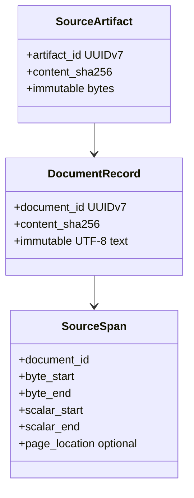

# TEPP Logical and Persistence ERD

**Status:** Accepted logical target model with current implementation maturity explicitly marked.  
**Last reviewed:** 2026-08-09

Protected main currently implements storage-independent evidence domain objects only. PR #5/#6 add temporal domain behavior on active branches. PostgreSQL migrations/tables are accepted-target and are **not implemented** on protected main yet.

## Current domain foundation

These names summarize the current `evidence_core` domain; they are not PostgreSQL table claims.

## Planned PostgreSQL ERD

```mermaid
erDiagram
    TENANT_RECORD ||--o{ DOCUMENT_RECORD : owns
    SOURCE_ARTIFACT ||--o{ DOCUMENT_RECORD : contains
    DOCUMENT_RECORD ||--o{ TEXT_SEGMENT : contains
    DOCUMENT_RECORD ||--o{ TEMPORAL_ASSERTION : carries
    TEXT_SEGMENT ||--o{ EVENT_MENTION : evidences
    EVENT_INSTANCE ||--o{ EVENT_MENTION : realized_by
    EVENT_INSTANCE ||--o{ EVENT_RELATION : source_event
    EVENT_INSTANCE ||--o{ EVENT_RELATION : target_event
    ENTITY_RECORD ||--o{ ENTITY_ROLE_ASSIGNMENT : assigned
    EVENT_INSTANCE ||--o{ ENTITY_ROLE_ASSIGNMENT : contextualizes
    PROJECT_RECORD ||--o{ ENTITY_ROLE_ASSIGNMENT : contextualizes
    DOCUMENT_RECORD ||--o{ MEMBERSHIP_ASSIGNMENT : observed_unit
    ENTITY_RECORD ||--o{ MEMBERSHIP_ASSIGNMENT : membership_target
    MODEL_RUN ||--o{ TOPIC_DEFINITION : estimates
    MODEL_RUN ||--o{ TOPIC_SCORE : estimates
    MODEL_RUN ||--o{ VALIDATION_METRIC : reports
    TOPIC_DEFINITION ||--o{ TOPIC_CORRELATION : source_topic
    TOPIC_DEFINITION ||--o{ TOPIC_CORRELATION : target_topic
    TOPIC_CLUSTER ||--o{ CLUSTER_MEMBERSHIP : contains
    TOPIC_DEFINITION ||--o{ CLUSTER_MEMBERSHIP : member
    MODEL_RUN ||--o{ FACTOR_SOLUTION : estimates
    FACTOR_SOLUTION ||--o{ FACTOR_LOADING : contains
    MODEL_RUN ||--o{ AUDIT_EVENT : evidenced_by

    TENANT_RECORD {
      uuid tenant_record_id PK
      text tenant_status_code
      timestamptz created_at
    }

    SOURCE_ARTIFACT {
      uuid source_artifact_id PK
      uuid tenant_record_id FK
      text content_sha256 UK
      bigint source_size_bytes
      text media_type_code
      text protected_object_ref
      timestamptz system_time
    }

    DOCUMENT_RECORD {
      uuid document_record_id PK
      uuid tenant_record_id FK
      uuid source_artifact_id FK
      text content_sha256
      text language_profile_code
      timestamptz assertion_time
      timestamptz document_time
      timestamptz system_time
      timestamptz available_time
    }

    TEXT_SEGMENT {
      uuid text_segment_id PK
      uuid document_record_id FK
      bigint byte_start
      bigint byte_end
      bigint scalar_start
      bigint scalar_end
      text segment_type_code
    }

    TEMPORAL_ASSERTION {
      uuid temporal_assertion_id PK
      uuid document_record_id FK
      text clock_type_code
      timestamptz lower_time
      timestamptz upper_time
      text lower_boundary_code
      text upper_boundary_code
      text source_precision_code
    }

    EVENT_INSTANCE {
      uuid event_instance_id PK
      uuid tenant_record_id FK
      text event_type_code
      timestamptz valid_from
      timestamptz valid_to
      text lifecycle_status_code
    }

    EVENT_MENTION {
      uuid event_mention_id PK
      uuid event_instance_id FK
      uuid text_segment_id FK
      numeric confidence_score
    }

    EVENT_RELATION {
      uuid event_relation_id PK
      uuid source_event_id FK
      uuid target_event_id FK
      text relation_type_code
      uuid evidence_segment_id FK
      numeric confidence_score
      boolean transition_edge
    }

    ENTITY_RECORD {
      uuid entity_record_id PK
      uuid tenant_record_id FK
      text entity_type_code
      text canonical_name
    }

    PROJECT_RECORD {
      uuid project_record_id PK
      uuid tenant_record_id FK
      text project_type_code
      text lifecycle_status_code
    }

    ENTITY_ROLE_ASSIGNMENT {
      uuid entity_role_assignment_id PK
      uuid entity_record_id FK
      uuid event_instance_id FK
      uuid project_record_id FK
      text role_type_code
      timestamptz valid_from
      timestamptz valid_to
      numeric membership_weight
      uuid evidence_segment_id FK
    }

    MEMBERSHIP_ASSIGNMENT {
      uuid membership_assignment_id PK
      uuid document_record_id FK
      uuid membership_target_id
      text membership_type_code
      numeric membership_weight
      timestamptz valid_from
      timestamptz valid_to
    }

    MODEL_RUN {
      uuid model_run_id PK
      uuid tenant_record_id FK
      text corpus_hash
      text engine_version
      text configuration_hash
      text compute_backend_code
      text random_seed_manifest_hash
      timestamptz knowledge_cutoff
      timestamptz created_at
    }

    TOPIC_DEFINITION {
      uuid topic_definition_id PK
      uuid model_run_id FK
      integer topic_number
      text topic_status_code
    }

    TOPIC_SCORE {
      uuid topic_score_id PK
      uuid model_run_id FK
      uuid document_record_id FK
      uuid topic_definition_id FK
      numeric posterior_mean
      numeric posterior_sd
    }

    TOPIC_CORRELATION {
      uuid topic_correlation_id PK
      uuid model_run_id FK
      uuid source_topic_id FK
      uuid target_topic_id FK
      numeric posterior_median
      numeric interval_lower
      numeric interval_upper
      numeric selection_probability
    }

    TOPIC_CLUSTER {
      uuid topic_cluster_id PK
      uuid model_run_id FK
      text cluster_status_code
      numeric stability_score
    }

    CLUSTER_MEMBERSHIP {
      uuid cluster_membership_id PK
      uuid topic_cluster_id FK
      uuid topic_definition_id FK
      numeric assignment_probability
    }

    FACTOR_SOLUTION {
      uuid factor_solution_id PK
      uuid model_run_id FK
      text model_type_code
      text invariance_status_code
    }

    FACTOR_LOADING {
      uuid factor_loading_id PK
      uuid factor_solution_id FK
      uuid topic_definition_id FK
      text factor_code
      numeric loading_estimate
      numeric standard_error
    }

    VALIDATION_METRIC {
      uuid validation_metric_id PK
      uuid model_run_id FK
      text metric_type_code
      text evaluation_slice_code
      numeric metric_value
      numeric interval_lower
      numeric interval_upper
    }

    AUDIT_EVENT {
      uuid audit_event_id PK
      uuid tenant_record_id FK
      uuid model_run_id FK
      text action_code
      text outcome_code
      text evidence_digest
      timestamptz system_time
    }
```

## Temporal/bitemporal invariants

- Event/valid time and system/record time are distinct.
- `available_time` gates historical inclusion through `knowledge_cutoff`.
- Retrospective evidence may describe an earlier event while retaining its later availability/system time.
- Transition edges never derive a reverse state transition from a backward-pointing citation/revision/retrospective edge.
- A future physical schema must represent uncertain/open intervals without coercing them to false exact timestamps.

## Multiple-membership invariant

Customer/partner/competitor/author/department/project roles are contextual time-varying assignments. They are not static attributes on `entity_record`. One document/event may have multiple weighted memberships.

## Provenance/reproducibility invariant

Every published analytical artifact must be traceable to source hashes, evidence spans, preprocessing/concept versions, model/configuration/seed, compute backend, dependency lock, and Git commit. Audit records store bounded evidence/digests rather than copying protected source text unnecessarily.

## Migration acceptance

Before this planned ERD becomes as-built, migrations must include rollback, tenant/RLS policy, temporal constraints/indexes, lineage integrity, idempotency/concurrency, retention/deletion, backup/recovery, and synthetic known-truth integration tests. The documentation maturity label then changes only after protected-main integration.