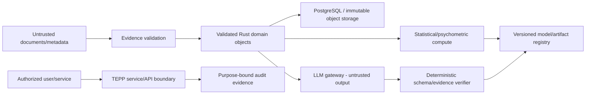

# TEPP Threat Model

**Status:** Accepted target security model; implementation maturity follows `docs/TRACEABILITY.md`.  
**Last reviewed:** 2026-08-13

## 1. Scope and protected assets

TEPP processes multilingual reports, metadata, event assertions, latent measurements, model artifacts, and potentially identifying organizational information. Protected assets include source evidence, exact spans, document/event/entity relationships, tenant and purpose context, model/configuration manifests, learned parameters, embeddings/concepts, access/audit evidence, LLM prompts/results, API credentials, and release provenance.

The threat model applies to standalone deployment and modular CWL integration. `naruon`, `contextual-orchestrator`, object storage, PostgreSQL, GPU runtimes, model providers, and other CWL services are separate trust domains connected only through explicit versioned contracts.

## 2. Trust boundaries

No external document, model output, provider response, serialized payload, database row, cached object, or imported model artifact is trusted solely because it crossed a prior boundary.

## 3. Principal threat classes

| Threat | Failure mode | Required control |
|---|---|---|
| Evidence substitution | bytes/text changed while record identity remains stable | immutable source storage, SHA-256 rehash on reconstruction, provenance binding |
| Temporal leakage | later-available evidence enters an earlier historical analysis | six-clock types, `available_time <= knowledge_cutoff`, relation-aware rolling split |
| Cross-tenant disclosure | source, model, concept or result crosses tenant boundary | tenant-scoped authorization, RLS/ABAC where persisted, scoped object references |
| Purpose creep | authorized PII is reused for a different analysis purpose | purpose-bound grants, explicit legal/contract basis metadata, audit and retention policy |
| Prompt injection | document text changes system/model instructions or requests tools/secrets | document content remains untrusted data, no document-driven tool/credential authority |
| LLM hallucination | unsupported interpretation promoted as measured fact | evidence-span binding, strict schema, independent verifier, abstention/unsupported-claim state |
| Model poisoning | malicious concept dictionary, checkpoint, adapter or calibration data | signed/versioned artifacts, provenance, review, validation corpus and recovery gates |
| Membership/role poisoning | customer/partner/competitor role fabricated or stale | time-bounded provenance-bearing assignment, confidence/evidence, observed-vs-inferred separation |
| Temporal relation poisoning | backward/contradictory relation enters transition graph | closed relation vocabulary, interval reasoner, forward-only transition validation |
| Numerical integrity failure | GPU/precision/concurrency produces materially different estimates | CPU `f64` reference, parity/recovery tests, bounded multithreading, explicit precision mode |
| Resource exhaustion | huge documents, relation graphs, VRAM allocations or LLM payloads cause denial of service | size/depth/count budgets, streaming, bounded closure/worker pools, adaptive VRAM, quotas |
| Serialization bypass | hostile JSON reconstructs invalid private state | explicit versioned DTOs, unknown-field rejection, reconstruct through domain validators |
| Formula/active-content injection | exported artifacts execute spreadsheet/formula/HTML payloads | export escaping/sanitization, no active document execution |
| Supply-chain compromise | mutable Actions/installers/dependencies alter build or release | full-SHA Actions, orphan registry-identity audit/disable, lockfiles, advisories/licenses, SBOM, SLSA-style provenance, reproducible release |
| Credential exfiltration | model/test/doc obtains secrets | minimum-scope secret materialization, `NVIDIA_NIM_API_KEY` only where required, never log/prompt secrets |
| Evidence over-retention | raw source/PII remains after purpose expires | lifecycle classification, configurable retention (`0007` `retention_policy`), deletion/tombstone evidence, legal-hold exception, immutable audit digest not raw copy |

## 4. PII handling without blanket masking

Blanket masking is not the default control because TEPP may require names, organizational roles, authorship, projects, customers, partners, competitors, and longitudinal identity to estimate valid cross-classified/multiple-membership structures. Instead TEPP uses layered controls:

1. separate identity-bearing source from analytical identifiers where possible;
2. use opaque/pseudonymous identifiers in modeling artifacts and ordinary logs;
3. retain re-identification mapping in a separately authorized encrypted boundary;
4. bind every privileged read/export to tenant, purpose, role, lifetime, and audit evidence;
5. encrypt source and model artifacts in transit and at rest with deployer-managed keys;
6. minimize provider disclosure and transmit only approved evidence spans/fields to LLMs;
7. enforce retention/export/deletion policy independently from model semantics;
8. treat inference of sensitive attributes and membership edges as protected derived data.

## 5. Scientific integrity threats

Scientific validity is part of TEPP's integrity boundary. Release gates must catch future-information leakage, language non-invariance, method/template contamination, unsupported causal claims, naïve correlation of compositional topic proportions, unstable topic K selection, weak parameter recovery, confidence miscalibration, and CPU/GPU divergence. A statistically invalid but technically successful run is a failed product result.

## 6. Abuse cases

- A report embeds instructions telling the LLM to reveal credentials or change model policy: ignore as source text and continue only through the fixed interpreter contract.
- A later audit report describes a 2024 incident: it may enrich a 2026 retrospective analysis but is excluded from a 2024-as-of model if unavailable then.
- The same company is customer in one project and competitor in another: represent separate time-valid role assignments, never overwrite a global company label.
- A provider returns a plausible topic label not supported by evidence spans: verifier marks it unsupported and it cannot become an accepted interpretation.
- GPU OOM occurs after several batches: release allocations, reduce bounded batch size, then CPU fallback or explicit resource failure; never silently change the estimand.

## 7. Security verification

Required evidence includes hostile Unicode/JSON, prompt injection, oversized/deep inputs, cross-tenant authorization, purpose/lifetime grant expiry, temporal leakage, relation contradiction, provenance tampering, model/artifact digest mismatch, export injection, resource-exhaustion, recovery, supply-chain, and deterministic CPU/GPU integrity tests.

## 8. Residual risk and non-claims

TEPP documentation describes readiness controls; it does not claim CSAP, SOC 2, ISO/IEC 42001, or other certification. Deployment operators remain responsible for infrastructure identity, network controls, KMS/HSM, physical security, provider contracts, regional requirements, and independent assurance unless a later accepted contract explicitly assigns those duties to TEPP.