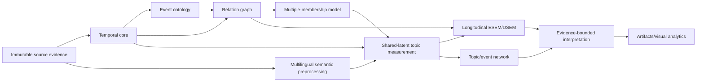
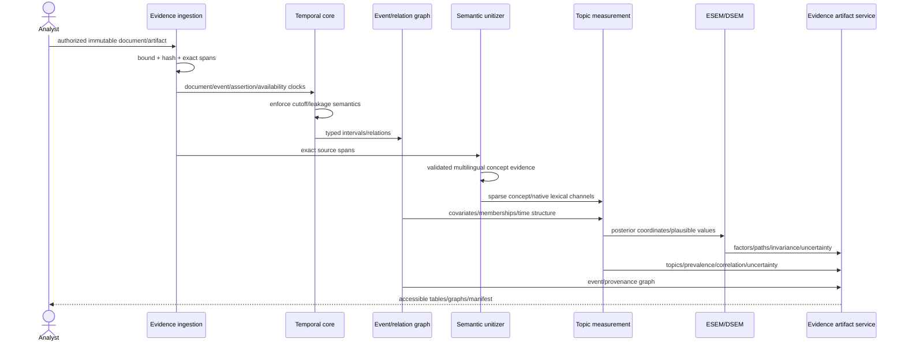
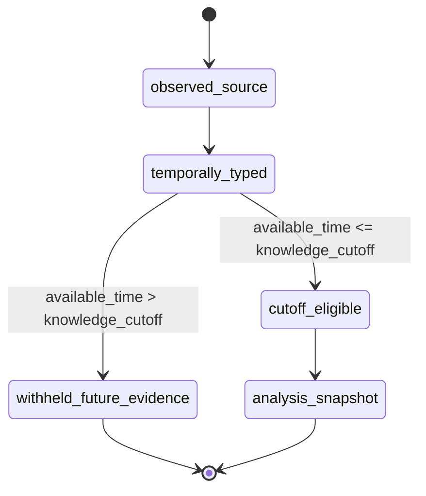
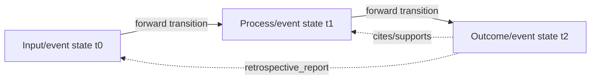
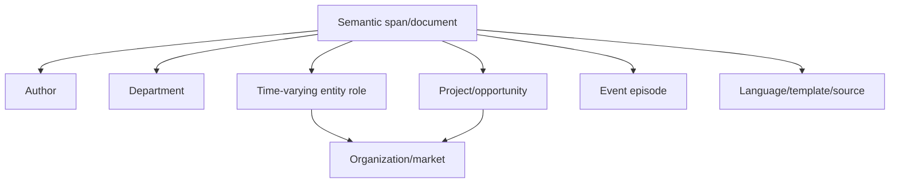
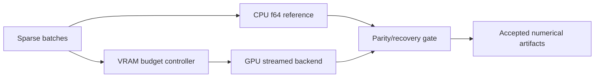
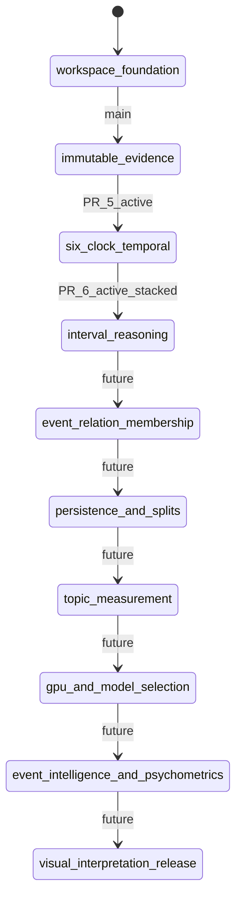

# TEPP UML and Scientific Runtime Views

**Status:** Accepted diagrams aligned to PRD v0.4; as-built versus target maturity is explicit.  
**Last reviewed:** 2026-08-09

## Platform component view

On current protected main only the workspace/evidence foundation is implemented. Temporal values are PR #5 active-PR; interval reasoning is PR #6 active-PR. Later boxes are accepted-target.

## Evidence-to-analysis sequence

## Six-clock availability state rule

A later document may report an earlier event, but it cannot be inserted into an earlier historical analysis before its availability time.

## Relation authority view

Solid transition edges obey forward temporal constraints. Provenance/evidence edges may point backward but do not become reverse state transitions.

## Cross-classified membership view

Membership is not forced into a single hierarchy; weights and validity intervals allow multiple simultaneous memberships.

## Compute view

GPU may be absent or fall back to CPU. A GPU result is not accepted merely because a kernel completed.

## Implementation/dependency state view

## Maintenance rule

Update these views when a scientific estimand, clock/interval semantics, relation authority, membership model, compute backend, persistence boundary, or implementation maturity changes. Active PRs become as-built only after protected-main integration and fresh required evidence.