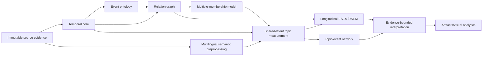
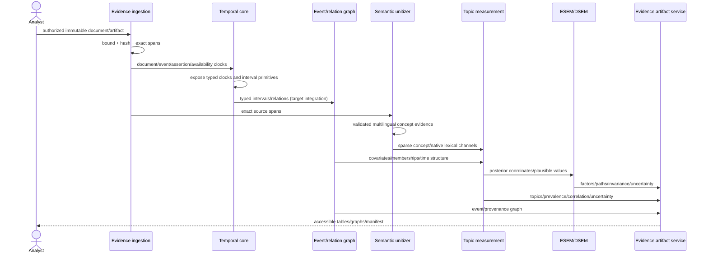
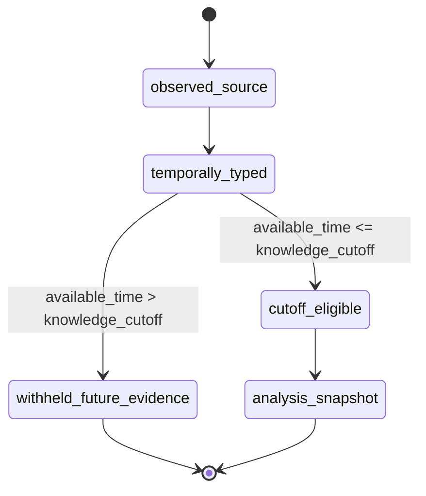
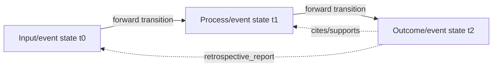
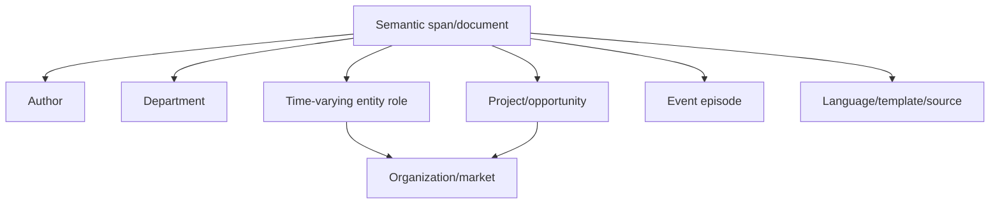
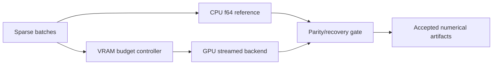
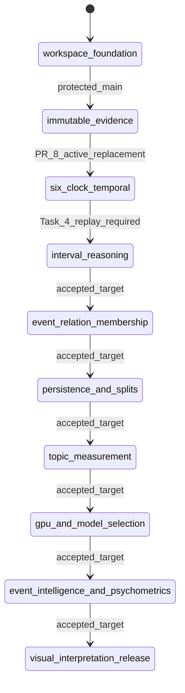

# TEPP UML and Scientific Runtime Views

**Status:** Accepted diagrams aligned to PRD v0.4; as-built versus target maturity is explicit.  
**Last reviewed:** 2026-08-12

## Platform component view

On current protected main the workspace/evidence foundation, six-clock temporal values, Allen algebra/path-consistency, event ontology/membership, and PostgreSQL persistence through restore-integrity probes are implemented. The active-PR `prediction_contradiction` crate is the promotion-authority gate: call `refuse_promotion` before authorizing promotion of unmatched predicted mass. Remaining TDT/CHRONOS, topic, psychometric, and service boxes stay accepted-target.

## Evidence-to-analysis sequence

PR #8 provides typed clock/interval primitives only. Persistence/corpus-split enforcement of historical cutoff eligibility and graph integration remain accepted-target rather than as-built leakage protection.

## Six-clock availability state rule

A later document may report an earlier event, but it cannot be inserted into an earlier historical analysis before its availability time. PR #8 implements the typed clock/interval primitives; persistence/split enforcement of `cutoff_eligible` remains accepted-target.

## Relation authority view

Solid transition edges obey forward temporal constraints. Provenance/evidence edges may point backward but do not become reverse state transitions.

## Cross-classified membership view

Membership is not forced into a single hierarchy; weights and validity intervals allow multiple simultaneous memberships.

## Compute view

GPU may be absent or fall back to CPU. A GPU result is not accepted merely because a kernel completed.

## Implementation/dependency state view

### Legacy stack note

PR #5 is superseded/conflicted lineage for Task 3. PR #6 remains a legacy Draft carrying Task 4 implementation history but is based on that superseded lineage. Its unique behavior must be replayed onto PR #8 or the exact protected-main descendant after PR #8 merges; old checks/reviews do not transfer.

## Maintenance rule

Update these views when a scientific estimand, clock/interval semantics, relation authority, membership model, compute backend, persistence boundary, implementation lineage, or maturity changes. Active PRs become as-built only after protected-main integration and fresh required evidence.
