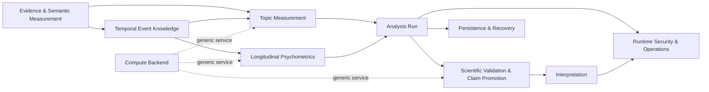

# TEPP Domain Context Map

Status: delivery refactoring authority for the 2026-09-01 queue-consolidation cycle.

This document applies Domain-Driven Design to the protected-main product. Cargo crates are implementation units; they are not automatically bounded contexts. A crate, ADR number, refusal helper, transport operation, clock type, or equation earns a separate boundary only when it has an independently meaningful domain lifecycle, ubiquitous language, invariants, and reuse boundary.

## Strategic design

### Core subdomains

| Bounded context | Product responsibility | Aggregate / authority | Current implementation nucleus |
| --- | --- | --- | --- |
| Evidence & Semantic Measurement | Preserve source evidence and derive span-grounded semantic/concept observations without replacing source truth | `EvidenceCorpus`, `SemanticUnitSet`, `ConceptDictionaryRevision` | `evidence_core`, `semantic_core` |
| Temporal Event Knowledge | Represent six clocks, event identity, interval relations, typed provenance/transition edges, and time-varying memberships | `EventEpisode`, `TemporalRelationSet`, `MembershipAssignmentSet` | `temporal_core`, `event_core`, `relation_graph`, `membership_core` |
| Topic Measurement | Estimate shared-latent temporal topic coordinates and uncertainty; preserve topic identity through activity/dormancy/reactivation | `TopicModelRun`, `TopicLineage` | `topic_measurement`, `topic_lineage`, `model_selection`, `network_analysis` |
| Longitudinal Psychometrics | Estimate longitudinal/multilevel psychometric quantities and model-comparison evidence | `PsychometricStudy`, `LongitudinalModelRun` | `psychometric_core`, `longitudinal_core`, `psychometric_fit` |
| Analysis Run | Orchestrate cutoff-safe accepted work into durable execution and typed terminal artifacts without owning scientific formulas | `AnalysisRun` | `analysis_engine` |
| Scientific Validation & Claim Promotion | Produce method-specific validation evidence, then decide whether a claim may be promoted under a preregistered evidence contract | `ValidationStudy`, `ClaimPromotionDecision` | `validation_core`, `tepp_simulation`; claim-promotion policy remains incomplete |

### Supporting subdomains

| Bounded context | Responsibility | Implementation nucleus |
| --- | --- | --- |
| Interpretation | Evidence-grounded interpretation and independent verification; never numerical authority | `interpretation_gateway` plus contextual-orchestrator ACL |
| Persistence & Recovery | Durable run/artifact storage, restart/recovery, outbox/checkpoint semantics | `persistence_postgres`, `checkpoint_authority` |
| Runtime Security & Operations | authenticated intake, TLS, operational audit, provider receipts, encrypted mappings | `intake_authorization`, `service_tls`, `operational_log`, `provider_receipt`, `encrypted_mapping` |

### Generic subdomains

`compute_backend`, `mlx_native_receipt`, serialization, hashing, and transport framing are generic infrastructure. They may serve several bounded contexts but may not define domain truth.

## Context map



Dependency direction follows the arrows. Transport, persistence, UI, and provider adapters may depend on domain/application contracts; domain code must not depend on HTTP, PostgreSQL, CLI, or provider-specific representations.

## Anti-corruption layers

- `tepp_api` is an HTTP/CLI adapter around Analysis Run and published read models. It must not own scientific acceptance, estimator formulas, event semantics, or persistence truth.
- `orchestrator_live` is an adapter for contextual-orchestrator. Provider vocabulary is translated into TEPP interpretation/application contracts before crossing the boundary.
- `persistence_postgres` implements repositories owned by domain/application contexts. Other contexts must not query its tables directly.
- `compute_backend` and `mlx_native_receipt` expose execution receipts; a backend receipt is not a scientific result.
- Naruon and LineageWeave contracts are external contexts. Their identifiers and transport vocabulary must remain behind explicit adapters rather than leaking into core aggregates.

## Ubiquitous language and invariants

- **Evidence** is immutable source-backed observation, not an inferred fact.
- **Semantic unit** is a span-grounded measured unit tied to source offsets and a versioned concept dictionary.
- **Event time** is when an event occurs; **available time** is when evidence becomes usable; **knowledge cutoff** is an analysis eligibility boundary. They are never aliases.
- **Transition edge** is forward-only state/process change; citation, summary, retrospective report, and support are provenance/evidence relations and never become transitions by coercion.
- **Membership assignment** may be cross-classified or multiple-membership and must not collapse language, template, department, project, location, or role into one entity identity.
- **Analysis run** owns lifecycle, idempotency, execution identity, and terminal artifact binding; it does not redefine estimators.
- **Validation evidence** records method-specific recovery/coverage/parity/invariance/convergence evidence. It is not itself a global scientific acceptance decision.
- **Claim promotion decision** may be made only from a preregistered, versioned evidence contract whose required dimensions are complete. LLM output cannot satisfy a numerical evidence requirement.

## Crate-boundary repair register

The following protected-main crates look like rule fragments rather than independent bounded contexts. They are retained temporarily to preserve remote-head compatibility, but new work must treat them as modules/value objects/invariants of the owning context and fold them when the corresponding product-vertical landing vehicle is replayed onto current main.

| Current crate fragments | Owning bounded context |
| --- | --- |
| `system_clock`, `event_clock`, `assertion_clock`, `cutoff_clock`, `available_clock`, `document_clocks`, `revision_order` | Temporal Event Knowledge |
| `summarizes_edge`, `retrospective_edge`, `support_edge`, `citation_edge`, `outcome_order`, `subevent_containment`, `prediction_contradiction`, `relation_absence`, `role_contradiction` | Temporal Event Knowledge |
| `location_membership`, `episode_membership`, `membership_target` | Temporal Event Knowledge |
| `prompt_source`, `style_source`, `modality_source`, `copied_text`, `copy_identity`, `corpus_background`, `stopword_deletion`, `payload_bound`, `derived_sensitivity` | Evidence & Semantic Measurement |
| `psychometric_fit` | Longitudinal Psychometrics |

A fold is permitted only after comparing the exact remote head and preserving unique tests, doctoring, research citations, and public compatibility. Public compatibility, when required, is provided by explicit adapters/re-exports with a removal plan; legacy paths do not remain canonical merely to avoid a refactor.

## Analysis Run directory rule

New `analysis_engine` profiles must be organized by the owning domain capability, not as an indefinitely growing flat list of one-file refusals. When the queue is replayed, use domain modules such as:

```text
analysis_engine/src/
  runs/                 # lifecycle, identity, idempotency
  evidence_measurement/ # source/method-effect admission profiles
  topic_measurement/    # topic/model-selection/lineage run composition
  psychometrics/        # longitudinal/measurement run composition
  event_intelligence/   # TDT/CHRONOS composition
  validation/           # validation evidence production only
```

Transport-only features stay in `tepp_api`; scientific claim promotion remains a separate application/domain policy boundary instead of being hidden inside one validation-run helper.

## Migration rule

Do not perform a repository-wide path rename while more than one hundred remote PR heads are open. That would create avoidable conflicts and discard concurrent-agent intent. Apply path repairs incrementally inside the selected landing vehicle for each bounded context, then close or retarget superseded micro-PRs with exact-head replacement mappings. The target architecture is mandatory; the migration is deliberately staged.