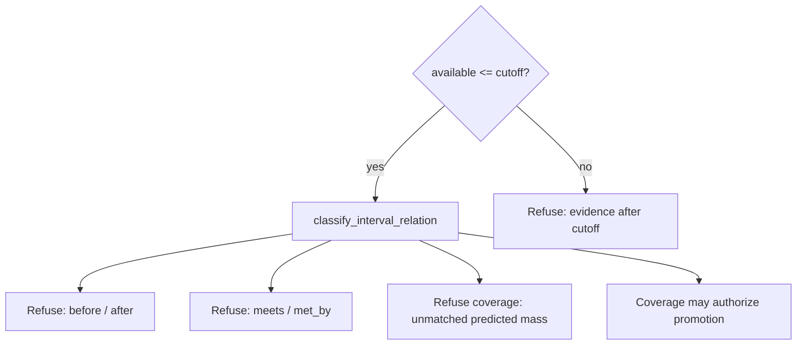

# Predicted-versus-observed temporal contradiction

## Scope

`prediction_contradiction` is a promotion policy over
`temporal_core::classify_interval_relation`. A predicted closed proper
event-time interval cannot become observed fact when the Allen relation is
`before` or `after` (contradiction) or `meets` / `met_by` (adjacent, no
interior overlap). Partial overlap (`overlaps`, `overlapped_by`, `contains`,
`started_by`, `finished_by`) is not a network contradiction, but it leaves
unmatched predicted mass. `require_observed_coverage` therefore succeeds only
for `during`, `starts`, `finishes`, and `equals`. Observed evidence whose
availability time exceeds the analysis knowledge cutoff is ineligible.

Label agreement on those flags is a helper for the gate. It is not RMSE,
bias, or interval-coverage recovery against a generative truth process.

This slice does not run the `temporal_core` path-consistency reasoner, fit
CHRONOS schemas, extract TDT tracks, or claim that the full ADR 0016
intelligence stack is implemented.

Next action: call `require_observed_coverage` before promoting a forecast.
`refuse_promotion` only answers whether the pair is contradictory or adjacent.

## Authority

### Normative TEPP contract

- `docs/adr/0016-tdt-chronos-event-intelligence-boundary.md` — predictions
  remain hypothetical until supported by later evidence; temporal
  contradiction can reject a proposed promotion.
- `docs/adr/0002-six-clock-temporal-semantics.md` — event/valid time is
  the clock for occurrence intervals; availability may not exceed cutoff.

### Supporting literature

Allen (1983) defines thirteen interval relations. `before` and `after` are
strictly disjoint with a gap. `meets` and `met_by` share an endpoint and are
not network contradictions. This crate uses that distinction for promotion
and does not implement the composition table or path consistency.

Allen, J. F. (1983). Maintaining knowledge about temporal intervals.
*Communications of the ACM, 26*(11), 832–843.
https://doi.org/10.1145/182.358434
